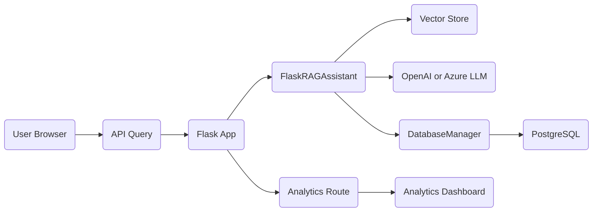

# RAG Knowledge Assistant & Analytics Dashboard

A Retrieval-Augmented Generation (RAG) assistant built with Flask, integrating a vector‐based knowledge store, OpenAI (or Azure OpenAI) LLMs, and PostgreSQL analytics. This project provides:
- Chat interface with inline citations  
- Feedback collection  
- Analytics dashboard with date filtering & export (JSON/CSV/Excel)  
- Developer evaluation modes  

---

## Table of Contents

1. [How It Works](#how-it-works)  
2. [Features](#features)  
3. [Architecture & Modules](#architecture--modules)  
4. [Configuration](#configuration)  
5. [Installation & Setup](#installation--setup)  
6. [Usage](#usage)  
7. [Analytics Dashboard](#analytics-dashboard)  
8. [Testing](#testing)  
9. [Deployment](#deployment)  
10. [Contributing](#contributing)  
11. [License](#license)  

---

## How It Works



1. **User** sends a query via `/api/query`.
2. **FlaskRAGAssistant** retrieves relevant documents from the vector store, constructs prompt, calls the LLM, and returns answer + sources.
3. **DatabaseManager** logs each query, response, citations, and feedback in PostgreSQL.
4. **Web UI** (chat and analytics) displays responses and dashboards.

---

## Features

- **Retrieval-Augmented QA Chat** with inline citations  
- **Source Tracking** and citation links  
- **Feedback Collection** and tagging  
- **Analytics Dashboard**  
  - Feedback summary, tag distribution, query metrics  
  - Date‐range picker  
  - Export JSON, CSV, or Excel  
- **Developer Evaluation Modes** (parameter controls)  

---

## Architecture & Modules

- **`main.py`** – Flask app, routes (`/`, `/api/query`, `/api/feedback`, `/analytics`, `/api/analytics`, export endpoints)  
- **`config.py`** – `.env` loading & default env var definitions  
- **`rag_assistant.py`** – `FlaskRAGAssistant` (vector retrieval + LLM wrapper)  
- **`db_manager.py`** – `DatabaseManager` (logging queries, feedback, analytics queries)  
- **`openai_logger_injector.py`**, **`openai_logger.py`** – Automatic JSON logging of OpenAI calls  
- **Feedback dashboards** (`export_feedback.py`, `feedback_dashboard*.py`) – standalone analytics  
- **Static assets** (`static/`, `assets/`) – JS/CSS for chat UI and analytics  
- **Templates** – inline HTML in `main.py` for chat UI (Tailwind CSS) and analytics  

---

## Configuration

Environment variables are loaded via `python-dotenv` from a `.env` file:

```ini
# OpenAI / Azure
OPENAI_KEY=…
AZURE_OPENAI_KEY=…
AZURE_OPENAI_ENDPOINT=…
AZURE_SEARCH_INDEX=…

# PostgreSQL
POSTGRES_HOST=…
POSTGRES_PORT=5432
POSTGRES_DB=…
POSTGRES_USER=…
POSTGRES_PASSWORD=…
POSTGRES_SSL_MODE=require

# Logging
LOG_LEVEL=INFO
LOG_FILE=app.log

# Feedback
FEEDBACK_DIR=feedback_data
FEEDBACK_FILE=feedback.json
```

---

## Installation & Setup

```bash
# 1. Clone repo
git clone <repo-url>
cd RAGKA-v1r1-Git

# 2. Create virtualenv & install
python3 -m venv .venv
source .venv/bin/activate
pip install -r requirements.txt

# 3. Populate .env
cp .env.example .env
# Edit .env with API keys and DB credentials

# 4. Initialize database (ensure `votes` & `rag_queries` tables exist)
# See `docs/postgres_integration_plan.md`

# 5. Run the app
python main.py --port 5002
```

---

## Usage

- **Chat UI**:  
  Open http://localhost:5002/ in your browser.  
- **Query API**:  
  POST `/api/query` with JSON `{ "query": "Your question" }`  
- **Feedback API**:  
  POST `/api/feedback` with JSON `{ "question":…, "response":…, "feedback_tags": […], "comment":…, "citations": […] }`  
- **Analytics Dashboard**:  
  GET `/analytics`  
- **Analytics API**:  
  GET `/api/analytics?start_date=YYYY-MM-DD&end_date=YYYY-MM-DD`  
- **Export**:  
  GET `/api/analytics/export?format=json|csv|excel`

---

## Analytics Dashboard

Navigate to `/analytics` to view:
- Feedback totals & trend charts  
- Tag distribution pie chart  
- Query frequency & response-time metrics  
- Recent interactions table  
- Export options (JSON/CSV/Excel)  

---

## Testing

Run unit tests and coverage:

```bash
pytest --maxfail=1 --disable-warnings -q
```

Key test files:
- `test_db_manager.py`  
- `test_feedback.py`  
- `test_feedback_api.py`  

---

## Deployment

- **Docker**  
  ```bash
  docker build -t ragka-app .
  docker-compose up -d
  ```
- **Heroku / Render**  
  - `Procfile` provided  
  - `runtime.txt`, `requirements.txt`  
- **Azure**  
  Use `Docker_To_Azure.sh` for automated deployment  

---

## Contributing

1. Fork the repo  
2. Create feature branch (`git checkout -b feature/xyz`)  
3. Commit changes & push  
4. Open a Pull Request  

---

## License

This project is licensed under the MIT License. See [LICENSE](LICENSE) for details.
